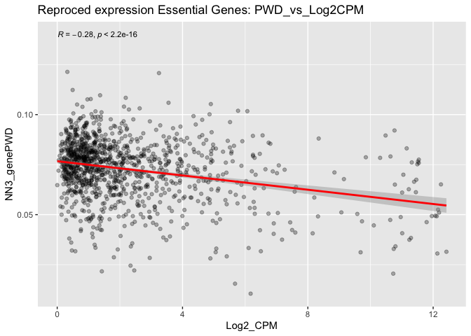
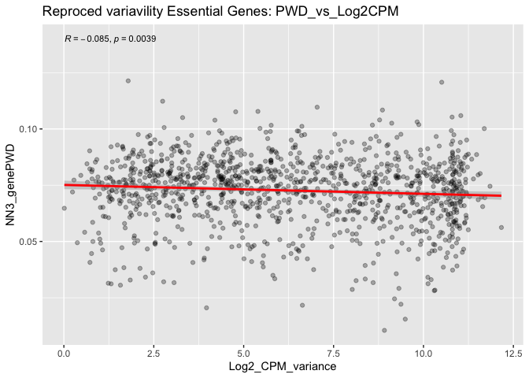
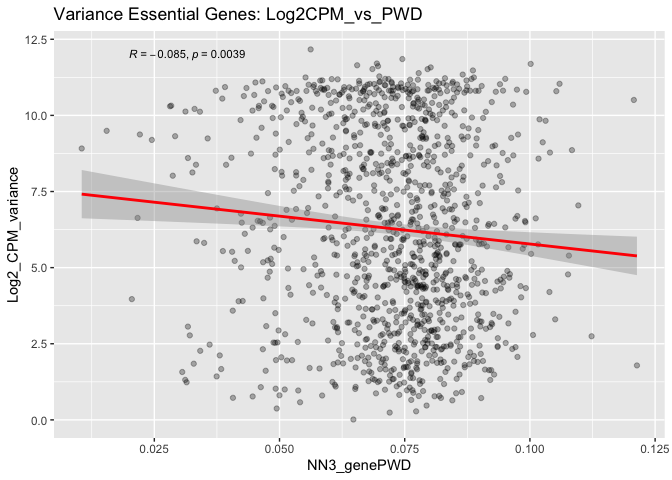

README
================
Yutian Liu
2023-01-26

# Research on the correlation between functional human genes and epigenetic conservation

## Mentor

Name: Dr. Kimberly Siegmund

Email: <kims@usc.edu>

## Introduction

This project is based on the paper called [“Functional human genes
typically exhibit epigenetic
conservation”](https://www.ncbi.nlm.nih.gov/pmc/articles/PMC8439480/),
where they have found that DepMap critical genes exhibit cell-specific
preferential epigenetic conservation by comparing DNA methylation
measurements across intestinal crypts from the same person as well as
between duplicate cell lines.Therefore, they raised the hypothesis that
essential genes are more conserved because if there is a deviation, it
is not an important area of the genome since the body does not have to
protect it.

## Things have done

- Recauculated the relationship between Colon epithelial average gene
  expression (log2 CPM) and variability (variance) with gene
  conservation (PWD)
- Reproduced and optimize drawn figure for a better visualization of the
  relationship

``` r
library(readxl)
library(dplyr)
library(cowplot)
library(ggplot2)
library(ggpubr)
library(devtools)
library(Matrix)
library(ggridges)
library(data.table)
```

# Normal Colon data

Read Single cell RNA-seq data from normal colon (GSE125970 (38)).For
normal colon, all rectal and colon cells were analyzed, and all
epithelial cells were analyzed for the CRCs. Raw reads were converted to
CPM (reads divided by total reads) and then to log2CPM (x+1). Average
gene log2CPM expression and log2CPM variance were calculated for all
cells, including zero values.

Colon epithelial average gene expression (log2 CPM) and variability
(variance) can be calculated from single cell RNA-seq data.

Based on DepMap data \[1\] to identify “essential” genes.

``` r
nmx <- readxl::read_xlsx("Normal_colon.xlsx")
```

``` r
change_col_name <- function(df){
  colnames(df)[2] <-"Log2_CPM"
  colnames(df)[3] <-"Log2_CPM_variance"
  colnames(df)[4] <-"NN3_genePWD"
  return(df)
}
dfs <- list(Nona_NN)
Nona_NN <-lapply(dfs, change_col_name )
Nona_NN <- rbindlist(Nona_NN)
dfs <- list(Nona_essential_depmap)
Nona_essential_depmap <-lapply(dfs, change_col_name )
Nona_essential_depmap <- rbindlist(Nona_essential_depmap)
dfs <- list(Nona_NotDepMap)
Nona_NotDepMap <-lapply(dfs, change_col_name )
Nona_NotDepMap <- rbindlist(Nona_NotDepMap)
```

## DepMap Essential Genes

``` r
cor(Nona_essential_depmap$NN3_genePWD, Nona_essential_depmap$Log2_CPM, method = c("pearson", "kendall", "spearman"))
```

    ## [1] -0.2834464

``` r
cor.test(Nona_essential_depmap$NN3_genePWD, Nona_essential_depmap$Log2_CPM, method=c("pearson", "kendall", "spearman"))
```

    ## 
    ##  Pearson's product-moment correlation
    ## 
    ## data:  Nona_essential_depmap$NN3_genePWD and Nona_essential_depmap$Log2_CPM
    ## t = -10.023, df = 1150, p-value < 2.2e-16
    ## alternative hypothesis: true correlation is not equal to 0
    ## 95 percent confidence interval:
    ##  -0.3357076 -0.2294457
    ## sample estimates:
    ##        cor 
    ## -0.2834464

If the correlation coefficient is greater than zero, it is a positive
relationship. Conversely, if the value is less than zero, it is a
negative relationship. A value of zero indicates that there is no
relationship between the two variables. From the result, negative and
significant correlations (p \< 0.05) were observed between gene PWDs and
gene expression/variability.

``` r
cor.test(Nona_essential_depmap$NN3_genePWD, Nona_essential_depmap$Log2_CPM, alternative = "less")
```

    ## 
    ##  Pearson's product-moment correlation
    ## 
    ## data:  Nona_essential_depmap$NN3_genePWD and Nona_essential_depmap$Log2_CPM
    ## t = -10.023, df = 1150, p-value < 2.2e-16
    ## alternative hypothesis: true correlation is less than 0
    ## 95 percent confidence interval:
    ##  -1.0000000 -0.2382335
    ## sample estimates:
    ##        cor 
    ## -0.2834464

### Visualization

#### Figures Reproduced

<!-- -->
<!-- -->

#### Density Plots & Change Y-X axis

<!-- -->
<!-- -->

Many PWDs are concentrated in the range from 0.06 to 0.08

<!-- -->

<!-- -->

## Non-DepMap Essential Genes

``` r
cor(Nona_NotDepMap$NN3_genePWD, Nona_NotDepMap$Log2_CPM, method = c("pearson", "kendall", "spearman"))
```

    ## [1] -0.2655226

``` r
cor.test(Nona_NotDepMap$NN3_genePWD, Nona_NotDepMap$Log2_CPM, method=c("pearson", "kendall", "spearman"))
```

    ## 
    ##  Pearson's product-moment correlation
    ## 
    ## data:  Nona_NotDepMap$NN3_genePWD and Nona_NotDepMap$Log2_CPM
    ## t = -31.747, df = 13288, p-value < 2.2e-16
    ## alternative hypothesis: true correlation is not equal to 0
    ## 95 percent confidence interval:
    ##  -0.2812547 -0.2496479
    ## sample estimates:
    ##        cor 
    ## -0.2655226

### Visualization

#### Figures Reproduced

<!-- -->
<!-- -->

#### Density Plots & Change Y-X axis

<!-- -->

<!-- -->

Many PWDs are concentrated in the range from 0.05 to 0.15

<!-- -->

<!-- -->

## Comparison between Essential genes & Non-Essential genes

``` r
# Plot distributions
Nona_NN %>%
  ggplot(aes(x = Log2_CPM,
             y = `common essential DepMap`,
             fill = `common essential DepMap`)) +
  ggridges::geom_density_ridges(bandwidth = 4) + ggtitle("Essential, Non-essential gene expression comparison ")
```

<!-- -->

``` r
# Compute the mean for and size of each group
group_means <-
  Nona_NN %>%
  group_by(`common essential DepMap`) %>%
  summarise(mean = mean(Log2_CPM),
            n = n())

group_means
```

    ## # A tibble: 2 × 3
    ##   `common essential DepMap`  mean     n
    ##   <chr>                     <dbl> <int>
    ## 1 DepMap_Essential           2.28  1152
    ## 2 Not_DepMap_Essential       1.16 13290

``` r
# Create our data visualisation
Nona_NN %>%
  ggplot(aes(x = `common essential DepMap`, y = Log2_CPM, fill = `common essential DepMap`)) +
  geom_boxplot() +

  # Add the mean for each group
  geom_point(data = group_means,
             aes(x = `common essential DepMap`, y = mean),
             shape = 3,
             size = 2)
```

<!-- -->

``` r
# Compute the mean for and size of each group
group_means <-
  Nona_NN %>%
  group_by(`common essential DepMap`) %>%
  summarise(mean = mean(NN3_genePWD),
            n = n())
# Create our data visualisation
Nona_NN %>%
  ggplot(aes(x = `common essential DepMap`, y = NN3_genePWD, fill = `common essential DepMap`)) +
  geom_boxplot() +

  # Add the mean for each group
  geom_point(data = group_means,
             aes(x = `common essential DepMap`, y = mean),
             shape = 3,
             size = 2)
```

<!-- -->

## Preliminary Conclusion

More variably and highly expressed genes are more conserved in normal
and neoplastic colon.

Colon epithelial average gene expression (log2 CPM) and variability
(variance) can be calculated from single cell RNA-seq data and
correlated (Pearson coefficient values in parenthesis) with gene
conservation (PWD). Negative and significant correlations (p \< 0.05)
were observed between gene PWDs and gene expression/variability.

PWDs in DepMap essential genes are concentrated in the range from 0.06
to 0.08 and PWDs in Non-DepMap essential gene are concentrated in the
range from 0.05 to 0.15.

## 1.20 Update Interactive Plots about TFs in paper

In the paper “Transcription factor expression as a predictor of colon
cancer prognosis: a machine learning practice”They identified five
transcription factors for the predictive model, and they are HOXC9,
ZNF556, HEYL, HOXC4 and HOXC6. Those five TFs(transcription factors) are
not in the common essential genes list. And in the paper “DNA
methylation events in transcription factors and gene expression changes
in colon cancer”, they selected 44 m-genes (methylation associated
genes) which showed a partial correlation adjusting by stromal content.
Those interactive plots are saved in this link. [Interactive
Plots](https://yutianl.shinyapps.io/DNAMethylationScatterPl/) You can
chose from the right legend and click the button twice to isolate them
for a better visualization. Choose the `Log2_CPM` as the Y variable and
`NN3_genePWD` as the X variable to view the association between gene
expression and pair distance.

## 1.23 Update: Target gene candidate transcription factor prediction，HOXC4 as the example

JASPAR (<http://jaspar.genereg.net/>) is an open-access database
containing manually curated, non-redundant transcription factor (TF)
binding profiles for TFs across six taxonomic groups. They have released
the 9th version at 2022 which I am going to use.

### Obtain the base sequence of the potential promoter region of the target gene

Go to NCBI [gene database](https://www.ncbi.nlm.nih.gov/gene/), search
for HOXC4, then find the genomic location information of the gene in the
“Genomic context”directory. It shows that HOXC4 is located at Chr12:
54016888 - 54056030. 

It is generally believed that the region 1000\~2000bp upstream of the
gene transcription start site is the promoter region of the gene. The
red arrow in the map below indicates that the gene is located in the
sense strand, and the direction of transcription is from left to right,
that is, the potential promoter region of the HOXC4 gene is
Chr12:54014888-54016888

Next, click the FASTA button in the Genomic regions, transcripts, and
products directory, enter the location information of the HOXC4 gene
promoter region on the right, and click Update View to get the potential
promoter sequence of the gene. Save the 
for later.

### Predict potential transcription factors that bind to target gene promoter regions

Enter the [UCSC database](http://genome.ucsc.edu/) homepage, select
Track Hubs from the My Data drop-down menu and click to enter, enter
JASPAR in the Public Hubs search bar, click Search Public Hubs, find
Connect in the search results and click, the page refreshes to prompt
JASPAR Track loaded successfully.

Return to the UCSC homepage, select the genome version consistent with
the above from the Genomes drop-down menu, and the page is refreshed to
display the genome information browsing page. Click hide all to hide all
tracks, then select pack in the drop-down menu of the latest version of
JASPAR, and then click refresh in the upper right corner to set it to
only retain the information interface of JASPAR track.

Enter the position Chr12:54014888-554016888 of the potential promoter
region of the HOXC4 gene in the search box, and click GO to get the
potential transcription factors bound to the promoter region of the RET
gene. The direction of the arrow behind the transcription factor
indicates the transcription direction, and the transcription factor that
is consistent with the transcription direction of the target gene is
preferred; the color of the arrow behind the transcription factor
indicates the prediction score. The darker the color, the higher the
score, and the more reliable the corresponding prediction result. Click
JASPAR to enter the setting interface. Generally, the Minimum Score
above 200 can be regarded as statistically significant. Since there are
many predicted transcription factors, I set 500 as the Minimum Score
here, and the page refresh shows that the predicted transcription
factors are significantly reduced.

### Predict the binding site sequence of candidate transcription factors in the target gene promoter region

Take the four transcription factors ZNF148, ZNF384,MTF1whose arrows are
predicted to be darker in color as examples. 

Enter the JASPAR homepage, enter NFIC in the search box, set the same as
the above, select the latest version of the search result, tick the
front, and click Add to cart on the right. Add other transcription
factors to the shopping cart in the same way, and then click View cart.

On the right toolbar Scan, find the potential promoter region sequence
of the RET gene queried from the NCBI database above in FASTA format,
copy all of them and paste them into the search box. The threshold is
80% by default. When there are many prediction results, the threshold
can be increased. Set 85% here , click Scan, the page is refreshed, and
the result shows the predicted binding site sequence.

Prediction score, the higher the score, the more reliable the prediction
result; the start and end positions of the TFBS sequence; the specific
base sequence. Click Copy to save the prediction results.

## 0126 Update TFBSTools identifies transcription factor binding sites

### TFSTools interacts with JASPAR2022 to obtain PWM(position weight matrices)

Data needed :

PWM, position weight matrices, transcription factors binding sequence
(From Jaspar)

A DNA sequence, or fasta format sequence(From NCBI)

Here, I am using the 5 TFs(HOXC9, ZNF556, HEYL, HOXC4 and HOXC6)
mentioned before as an example to show the result.

``` r
opts <- list()
opts[["species"]] <- 'Homo sapiens'
opts["collection"] <-  'CORE'
PFMatrixList <- getMatrixSet(JASPAR2022, opts)
## To PWM
pwm <- toPWM(PFMatrixList)
pwm
```

    ## PWMatrixList of length 692
    ## names(692): MA0030.1 MA0031.1 MA0051.1 MA0059.1 ... MA1630.2 MA1633.2 MA0597.2

### Download sequence FASTA file from NCBI

### Gene Name Transfer

HOXC9, ZNF556, HEYL, HOXC4 and HOXC6 are symbol names, transfer them
into Entrezid for fetching them from NCBI.

``` r
E_genes <- c("HOXC9", "ZNF556", "HEYL", "HOXC4", "HOXC6")
gene_map <- select(org.Hs.eg.db, keys=E_genes, keytype="SYMBOL", columns=c("ENTREZID", "SYMBOL"))
```

    ## 'select()' returned 1:1 mapping between keys and columns

``` r
gene_map
```

    ##   SYMBOL ENTREZID
    ## 1  HOXC9     3225
    ## 2 ZNF556    80032
    ## 3   HEYL    26508
    ## 4  HOXC4     3221
    ## 5  HOXC6     3223

Use `entrez_link()` section to find transcript for a given gene. I will
fetch cDNA sequences of those transcripts. First, get nucleotide IDs for
refseq transcripts of two genes:

Then get the sequences with `entrez_fetch`, acquire the fasta format by
setting the \`rettype\`\`

``` r
all_recs <- entrez_fetch(db="nucleotide", id=linked_transripts, rettype="fasta")
cat(strwrap(substr(all_recs, 1, 500)), sep="\n")
```

    ## >XM_005270745.4 PREDICTED: Homo sapiens hes related family bHLH
    ## transcription factor with YRPW motif like (HEYL), transcript variant
    ## X1, mRNA
    ## GGGTTGCAGGAGCCGGAGCCACCGCGCCGCGGTACGCGGTTCCCCGACGGCCGCCGCGAGGGGCGAGGAG
    ## CGAGGAGCGAGGGGCGAAGGGCGAGGCCGAGCAGCCAGATGGCCAGGCCGCTGTCCACCCCCAGCTCTTC
    ## GCAGATGCAAGCCAGGAAGAAACACAGAGGGATCATAGAGAAACGGCGTCGAGACCGCATCAACAGTAGC
    ## CTTTCTGAATTGCGACGCTTGGTCCCCACTGCCTTTGAGAAACAGGGCTCTTCCAAGCTGGAGAAAGCCG
    ## AGGTCTTGCAGATGACGGTGGATCACTTGAAAATGCTCCATGCCACTGGTGGGACAGGATTCTTTGATGC
    ## CCG

``` r
write(all_recs, file="my5transcripts.fasta")
```

``` r
# Load weight file 
data(MA0003.2)
pwm <- PWMatrixList(MA0003.2=toPWM(MA0003.2))
dnas <- Biostrings::readDNAStringSet("my5transcripts.fasta")
sitesets <- searchSeq(pwm, dnas, seqname="seqs", min.score="80%", strand="+")
## strand="+"，only test on + strand
```

``` r
# look the result 
head(writeGFF3(sitesets))
```

    ##                                                                                                                                                                                                                                                                                              seqname
    ## MA0003.2.XM_005270745.4 PREDICTED: Homo sapiens hes related family bHLH transcription factor with YRPW motif like (HEYL), transcript variant X1, mRNA.1 XM_005270745.4 PREDICTED: Homo sapiens hes related family bHLH transcription factor with YRPW motif like (HEYL), transcript variant X1, mRNA
    ## MA0003.2.XM_005270745.4 PREDICTED: Homo sapiens hes related family bHLH transcription factor with YRPW motif like (HEYL), transcript variant X1, mRNA.2 XM_005270745.4 PREDICTED: Homo sapiens hes related family bHLH transcription factor with YRPW motif like (HEYL), transcript variant X1, mRNA
    ## MA0003.2.XM_005270745.4 PREDICTED: Homo sapiens hes related family bHLH transcription factor with YRPW motif like (HEYL), transcript variant X1, mRNA.3 XM_005270745.4 PREDICTED: Homo sapiens hes related family bHLH transcription factor with YRPW motif like (HEYL), transcript variant X1, mRNA
    ## MA0003.2.XM_005270745.4 PREDICTED: Homo sapiens hes related family bHLH transcription factor with YRPW motif like (HEYL), transcript variant X1, mRNA.4 XM_005270745.4 PREDICTED: Homo sapiens hes related family bHLH transcription factor with YRPW motif like (HEYL), transcript variant X1, mRNA
    ## MA0003.2.XM_005270745.4 PREDICTED: Homo sapiens hes related family bHLH transcription factor with YRPW motif like (HEYL), transcript variant X1, mRNA.5 XM_005270745.4 PREDICTED: Homo sapiens hes related family bHLH transcription factor with YRPW motif like (HEYL), transcript variant X1, mRNA
    ## MA0003.2.XM_005270745.4 PREDICTED: Homo sapiens hes related family bHLH transcription factor with YRPW motif like (HEYL), transcript variant X1, mRNA.6 XM_005270745.4 PREDICTED: Homo sapiens hes related family bHLH transcription factor with YRPW motif like (HEYL), transcript variant X1, mRNA
    ##                                                                                                                                                         source
    ## MA0003.2.XM_005270745.4 PREDICTED: Homo sapiens hes related family bHLH transcription factor with YRPW motif like (HEYL), transcript variant X1, mRNA.1   TFBS
    ## MA0003.2.XM_005270745.4 PREDICTED: Homo sapiens hes related family bHLH transcription factor with YRPW motif like (HEYL), transcript variant X1, mRNA.2   TFBS
    ## MA0003.2.XM_005270745.4 PREDICTED: Homo sapiens hes related family bHLH transcription factor with YRPW motif like (HEYL), transcript variant X1, mRNA.3   TFBS
    ## MA0003.2.XM_005270745.4 PREDICTED: Homo sapiens hes related family bHLH transcription factor with YRPW motif like (HEYL), transcript variant X1, mRNA.4   TFBS
    ## MA0003.2.XM_005270745.4 PREDICTED: Homo sapiens hes related family bHLH transcription factor with YRPW motif like (HEYL), transcript variant X1, mRNA.5   TFBS
    ## MA0003.2.XM_005270745.4 PREDICTED: Homo sapiens hes related family bHLH transcription factor with YRPW motif like (HEYL), transcript variant X1, mRNA.6   TFBS
    ##                                                                                                                                                         feature
    ## MA0003.2.XM_005270745.4 PREDICTED: Homo sapiens hes related family bHLH transcription factor with YRPW motif like (HEYL), transcript variant X1, mRNA.1    TFBS
    ## MA0003.2.XM_005270745.4 PREDICTED: Homo sapiens hes related family bHLH transcription factor with YRPW motif like (HEYL), transcript variant X1, mRNA.2    TFBS
    ## MA0003.2.XM_005270745.4 PREDICTED: Homo sapiens hes related family bHLH transcription factor with YRPW motif like (HEYL), transcript variant X1, mRNA.3    TFBS
    ## MA0003.2.XM_005270745.4 PREDICTED: Homo sapiens hes related family bHLH transcription factor with YRPW motif like (HEYL), transcript variant X1, mRNA.4    TFBS
    ## MA0003.2.XM_005270745.4 PREDICTED: Homo sapiens hes related family bHLH transcription factor with YRPW motif like (HEYL), transcript variant X1, mRNA.5    TFBS
    ## MA0003.2.XM_005270745.4 PREDICTED: Homo sapiens hes related family bHLH transcription factor with YRPW motif like (HEYL), transcript variant X1, mRNA.6    TFBS
    ##                                                                                                                                                         start
    ## MA0003.2.XM_005270745.4 PREDICTED: Homo sapiens hes related family bHLH transcription factor with YRPW motif like (HEYL), transcript variant X1, mRNA.1   412
    ## MA0003.2.XM_005270745.4 PREDICTED: Homo sapiens hes related family bHLH transcription factor with YRPW motif like (HEYL), transcript variant X1, mRNA.2   422
    ## MA0003.2.XM_005270745.4 PREDICTED: Homo sapiens hes related family bHLH transcription factor with YRPW motif like (HEYL), transcript variant X1, mRNA.3   516
    ## MA0003.2.XM_005270745.4 PREDICTED: Homo sapiens hes related family bHLH transcription factor with YRPW motif like (HEYL), transcript variant X1, mRNA.4   524
    ## MA0003.2.XM_005270745.4 PREDICTED: Homo sapiens hes related family bHLH transcription factor with YRPW motif like (HEYL), transcript variant X1, mRNA.5   582
    ## MA0003.2.XM_005270745.4 PREDICTED: Homo sapiens hes related family bHLH transcription factor with YRPW motif like (HEYL), transcript variant X1, mRNA.6   693
    ##                                                                                                                                                         end
    ## MA0003.2.XM_005270745.4 PREDICTED: Homo sapiens hes related family bHLH transcription factor with YRPW motif like (HEYL), transcript variant X1, mRNA.1 426
    ## MA0003.2.XM_005270745.4 PREDICTED: Homo sapiens hes related family bHLH transcription factor with YRPW motif like (HEYL), transcript variant X1, mRNA.2 436
    ## MA0003.2.XM_005270745.4 PREDICTED: Homo sapiens hes related family bHLH transcription factor with YRPW motif like (HEYL), transcript variant X1, mRNA.3 530
    ## MA0003.2.XM_005270745.4 PREDICTED: Homo sapiens hes related family bHLH transcription factor with YRPW motif like (HEYL), transcript variant X1, mRNA.4 538
    ## MA0003.2.XM_005270745.4 PREDICTED: Homo sapiens hes related family bHLH transcription factor with YRPW motif like (HEYL), transcript variant X1, mRNA.5 596
    ## MA0003.2.XM_005270745.4 PREDICTED: Homo sapiens hes related family bHLH transcription factor with YRPW motif like (HEYL), transcript variant X1, mRNA.6 707
    ##                                                                                                                                                            score
    ## MA0003.2.XM_005270745.4 PREDICTED: Homo sapiens hes related family bHLH transcription factor with YRPW motif like (HEYL), transcript variant X1, mRNA.1 3.399009
    ## MA0003.2.XM_005270745.4 PREDICTED: Homo sapiens hes related family bHLH transcription factor with YRPW motif like (HEYL), transcript variant X1, mRNA.2 1.841406
    ## MA0003.2.XM_005270745.4 PREDICTED: Homo sapiens hes related family bHLH transcription factor with YRPW motif like (HEYL), transcript variant X1, mRNA.3 3.568339
    ## MA0003.2.XM_005270745.4 PREDICTED: Homo sapiens hes related family bHLH transcription factor with YRPW motif like (HEYL), transcript variant X1, mRNA.4 5.055859
    ## MA0003.2.XM_005270745.4 PREDICTED: Homo sapiens hes related family bHLH transcription factor with YRPW motif like (HEYL), transcript variant X1, mRNA.5 3.528688
    ## MA0003.2.XM_005270745.4 PREDICTED: Homo sapiens hes related family bHLH transcription factor with YRPW motif like (HEYL), transcript variant X1, mRNA.6 6.887269
    ##                                                                                                                                                         strand
    ## MA0003.2.XM_005270745.4 PREDICTED: Homo sapiens hes related family bHLH transcription factor with YRPW motif like (HEYL), transcript variant X1, mRNA.1      +
    ## MA0003.2.XM_005270745.4 PREDICTED: Homo sapiens hes related family bHLH transcription factor with YRPW motif like (HEYL), transcript variant X1, mRNA.2      +
    ## MA0003.2.XM_005270745.4 PREDICTED: Homo sapiens hes related family bHLH transcription factor with YRPW motif like (HEYL), transcript variant X1, mRNA.3      +
    ## MA0003.2.XM_005270745.4 PREDICTED: Homo sapiens hes related family bHLH transcription factor with YRPW motif like (HEYL), transcript variant X1, mRNA.4      +
    ## MA0003.2.XM_005270745.4 PREDICTED: Homo sapiens hes related family bHLH transcription factor with YRPW motif like (HEYL), transcript variant X1, mRNA.5      +
    ## MA0003.2.XM_005270745.4 PREDICTED: Homo sapiens hes related family bHLH transcription factor with YRPW motif like (HEYL), transcript variant X1, mRNA.6      +
    ##                                                                                                                                                         frame
    ## MA0003.2.XM_005270745.4 PREDICTED: Homo sapiens hes related family bHLH transcription factor with YRPW motif like (HEYL), transcript variant X1, mRNA.1     .
    ## MA0003.2.XM_005270745.4 PREDICTED: Homo sapiens hes related family bHLH transcription factor with YRPW motif like (HEYL), transcript variant X1, mRNA.2     .
    ## MA0003.2.XM_005270745.4 PREDICTED: Homo sapiens hes related family bHLH transcription factor with YRPW motif like (HEYL), transcript variant X1, mRNA.3     .
    ## MA0003.2.XM_005270745.4 PREDICTED: Homo sapiens hes related family bHLH transcription factor with YRPW motif like (HEYL), transcript variant X1, mRNA.4     .
    ## MA0003.2.XM_005270745.4 PREDICTED: Homo sapiens hes related family bHLH transcription factor with YRPW motif like (HEYL), transcript variant X1, mRNA.5     .
    ## MA0003.2.XM_005270745.4 PREDICTED: Homo sapiens hes related family bHLH transcription factor with YRPW motif like (HEYL), transcript variant X1, mRNA.6     .
    ##                                                                                                                                                                                                   attributes
    ## MA0003.2.XM_005270745.4 PREDICTED: Homo sapiens hes related family bHLH transcription factor with YRPW motif like (HEYL), transcript variant X1, mRNA.1 TF=TFAP2A;class=Zipper-Type;sequence=AGGTACCTGGGGGTC
    ## MA0003.2.XM_005270745.4 PREDICTED: Homo sapiens hes related family bHLH transcription factor with YRPW motif like (HEYL), transcript variant X1, mRNA.2 TF=TFAP2A;class=Zipper-Type;sequence=GGGTCCTTGAAGGGC
    ## MA0003.2.XM_005270745.4 PREDICTED: Homo sapiens hes related family bHLH transcription factor with YRPW motif like (HEYL), transcript variant X1, mRNA.3 TF=TFAP2A;class=Zipper-Type;sequence=CACGCCCACTGGCCC
    ## MA0003.2.XM_005270745.4 PREDICTED: Homo sapiens hes related family bHLH transcription factor with YRPW motif like (HEYL), transcript variant X1, mRNA.4 TF=TFAP2A;class=Zipper-Type;sequence=CTGGCCCTTTGGCCT
    ## MA0003.2.XM_005270745.4 PREDICTED: Homo sapiens hes related family bHLH transcription factor with YRPW motif like (HEYL), transcript variant X1, mRNA.5 TF=TFAP2A;class=Zipper-Type;sequence=GCCAGCCCTGAGCAA
    ## MA0003.2.XM_005270745.4 PREDICTED: Homo sapiens hes related family bHLH transcription factor with YRPW motif like (HEYL), transcript variant X1, mRNA.6 TF=TFAP2A;class=Zipper-Type;sequence=CAGAGCCACAGGCAT

## Things to do

- Download the transcription factor binding sites from [JASPAR
  database](https://jaspar.genereg.net/) to compare the regions we found
  interesting to examine if this hypothesis still stands in terms of
  transcriptome markers.
