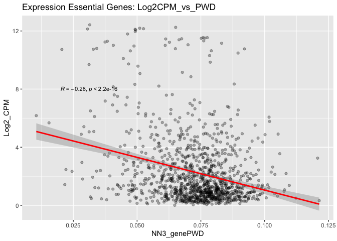

README
================
yutian
2022-12-13

# Research on the correlation between functional human genes and epigenetic conservation

## Mentor

Name: Dr. Kimberly Siegmund

Email: <kims@usc.edu>

## Introduction

This project is based on the paper called [“Functional human genes
typically exhibit epigenetic
conservation”](https://www.ncbi.nlm.nih.gov/pmc/articles/PMC8439480/),
where they have found that DepMap critical genes exhibit cell-specific
preferential epigenetic conservation by comparing DNA methylation
measurements across intestinal crypts from the same person as well as
between duplicate cell lines.Therefore, they raised the hypothesis that
essential genes are more conserved because if there is a deviation, it
is not an important area of the genome since the body does not have to
protect it.

## Things have done

- Recauculated the relationship between Colon epithelial average gene
  expression (log2 CPM) and variability (variance) with gene
  conservation (PWD)
- Reproduced and optimize drawn figure for a better visualization of the
  relationship

### DepMap Essential Genes

``` r
cor(Nona_essential_depmap$NN3_genePWD, Nona_essential_depmap$Log2_CPM, method = c("pearson", "kendall", "spearman"))
```

    ## [1] -0.2834464

``` r
cor.test(Nona_essential_depmap$NN3_genePWD, Nona_essential_depmap$Log2_CPM, method=c("pearson", "kendall", "spearman"))
```

    ## 
    ##  Pearson's product-moment correlation
    ## 
    ## data:  Nona_essential_depmap$NN3_genePWD and Nona_essential_depmap$Log2_CPM
    ## t = -10.023, df = 1150, p-value < 2.2e-16
    ## alternative hypothesis: true correlation is not equal to 0
    ## 95 percent confidence interval:
    ##  -0.3357076 -0.2294457
    ## sample estimates:
    ##        cor 
    ## -0.2834464

If the correlation coefficient is greater than zero, it is a positive
relationship. Conversely, if the value is less than zero, it is a
negative relationship. A value of zero indicates that there is no
relationship between the two variables.

``` r
cor.test(Nona_essential_depmap$NN3_genePWD, Nona_essential_depmap$Log2_CPM, alternative = "less")
```

    ## 
    ##  Pearson's product-moment correlation
    ## 
    ## data:  Nona_essential_depmap$NN3_genePWD and Nona_essential_depmap$Log2_CPM
    ## t = -10.023, df = 1150, p-value < 2.2e-16
    ## alternative hypothesis: true correlation is less than 0
    ## 95 percent confidence interval:
    ##  -1.0000000 -0.2382335
    ## sample estimates:
    ##        cor 
    ## -0.2834464

<!-- -->

<!-- -->

<!-- -->

<!-- -->

<!-- -->

<!-- -->

<!-- -->

<!-- -->

## Preliminary Conclusion

More variably and highly expressed genes are more conserved in normal
and neoplastic colon.

Colon epithelial average gene expression (log2 CPM) and variability
(variance) can be calculated from single cell RNA-seq data and
correlated (Pearson coefficient values in parenthesis) with gene
conservation (PWD). Negative and significant correlations (p \< 0.05)
were observed between gene PWDs and gene expression/variability.

## Things to do

- Download the transcription factor binding sites from [JASPAR
  database](https://jaspar.genereg.net/) to compare the regions we found
  interesting to examine if this hypothesis still stands in terms of
  transcriptome markers.
